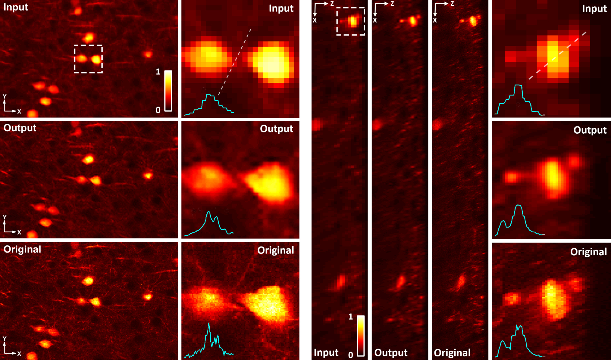

# S-Vision


***Note***: Code repository for "Self-Supervised Deep Learning Two-Photon Microscopy"

## Environments ##
The code has been tested using:
- Ubuntu 18.04
- Python 3.6
- CPU or NVIDIA GPU + CUDA CuDNN

## Getting started ##

### Installation ###
- Clone the repo:
```bash
  > git clone https://github.com/frankheyz/s-vision.git
  > cd s-vision
```

- Install packages from `requirement.txt`
```bash
  > pip3 install -r requirements.txt
```

- Config the parameters in `config.py`
  - note that 2D and 3D images are configured in different class
  - `image_path`: file path of the test image (supports .tif format input, update 'configs3D' if the input is 3D)
  - `save_path`: output file path
  - `max_epochs`: maximum training epoch
  - see code comments for details


- S-Vision train/test
  - run the following code will train a 3d model using the input image specified in the `configs.py` for 1500 epochs
  ```bash
    > python train_model.py -c 3d -e 1500
  ```
  - see comments in `train_model.py` for the descriptions of input arguments


- Check the results in the `save_path`